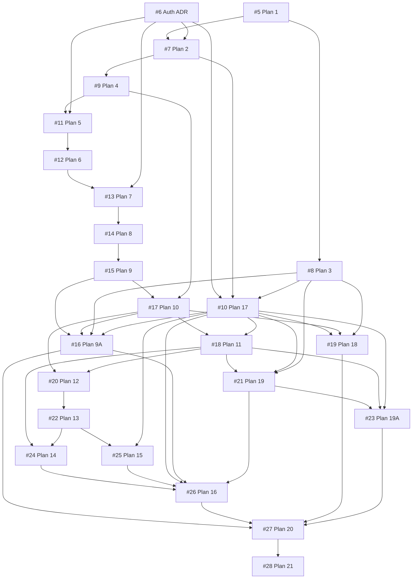

# Initial Implementation Issues / Plan

This file is the implementation plan and GitHub Issue index. Plan IDs are stable document identifiers, not GitHub Issue numbers. Each plan below links to its registered Issue, direct prerequisites, labels, and physical acceptance requirements; implementation remains open until its Acceptance Criteria are verified.

Dependencies describe completion order, not a requirement to delay independent mock/contract work. Human-facing routes must remain unavailable until the authorization prerequisite and Plan 17 enforcement are complete. Hardware flags describe the acceptance of each Issue; mockable portions may proceed first, and Plan 21 records final deployment acceptance.

Existing Issues are separate: [#1](https://github.com/TomokiAkiyama06/server-sentinel/issues/1) tracks specification/bootstrap, [#3](https://github.com/TomokiAkiyama06/server-sentinel/issues/3) tracks Claude authentication setup (already closed), and [#4](https://github.com/TomokiAkiyama06/server-sentinel/issues/4) tracks hardened review enforcement. Plan 1 adds CI lint/test and secret/fixture guards rather than duplicating #4.

Label meanings: `server-required` means a Main Server or Capture Node is needed; `hardware-required` means final acceptance needs a physical host, camera, GPU, storage, network, or client device; `manual-test-required` means manual host/browser/network or GitHub-configuration acceptance. The per-plan Main Server / Capture Node / UVC fields identify the actual environment. A mockable implementation is not permission to close an Issue whose final acceptance requires real hardware. Pure viewport/API/synthetic tests remain hardware-free; deployment acceptance stays in Plan 21.

## GitHub Issue index

Audited 2026-09-20 against the current specification. CI foundation #5 is implemented and closes on merge of its CI delivery PR; the other 23 implementation/ADR Issues remain OPEN. This is not runtime completion. Status below records the delivery state of this revision; labels, physical requirements, dependencies, and acceptance summaries follow in each Plan.

| Plan | GitHub Issue | Title | Status |
|---|---|---|---|
| Plan 1 | [#5](https://github.com/TomokiAkiyama06/server-sentinel/issues/5) | Plan 1: CIとRepositoryガードの整備 | CLOSED on CI PR merge |
| Blocking prerequisite | [#6](https://github.com/TomokiAkiyama06/server-sentinel/issues/6) | Blocking prerequisite: Owner認可とtrusted Tailscale identityのADR策定 | OPEN |
| Plan 2 | [#7](https://github.com/TomokiAkiyama06/server-sentinel/issues/7) | Plan 2: Backend基盤の構築 | OPEN |
| Plan 3 | [#8](https://github.com/TomokiAkiyama06/server-sentinel/issues/8) | Plan 3: React Dashboard基盤の構築 | OPEN |
| Plan 4 | [#9](https://github.com/TomokiAkiyama06/server-sentinel/issues/9) | Plan 4: Camera Source Registryの実装 | OPEN |
| Plan 5 | [#11](https://github.com/TomokiAkiyama06/server-sentinel/issues/11) | Plan 5: Local UVC検出と安定したCamera identityの実装 | OPEN |
| Plan 6 | [#12](https://github.com/TomokiAkiyama06/server-sentinel/issues/12) | Plan 6: media-capture-agent基盤の構築 | OPEN |
| Plan 7 | [#13](https://github.com/TomokiAkiyama06/server-sentinel/issues/13) | Plan 7: Capture Node pairingとmTLS trustの実装 | OPEN |
| Plan 8 | [#14](https://github.com/TomokiAkiyama06/server-sentinel/issues/14) | Plan 8: LAN ingest境界と負荷制限の実装 | OPEN |
| Plan 9 | [#15](https://github.com/TomokiAkiyama06/server-sentinel/issues/15) | Plan 9: Agent–Main transportのPoCとADR策定 | OPEN |
| Plan 9A | [#16](https://github.com/TomokiAkiyama06/server-sentinel/issues/16) | Plan 9A: Agent disk ring bufferと自律的incident証拠保護の実装 | OPEN |
| Plan 10 | [#17](https://github.com/TomokiAkiyama06/server-sentinel/issues/17) | Plan 10: Capture・Recording・Inference・Viewer profile の分離 | OPEN |
| Plan 11 | [#18](https://github.com/TomokiAkiyama06/server-sentinel/issues/18) | Plan 11: 永続録画と Main Server の圧縮 pre-roll | OPEN |
| Plan 12 | [#20](https://github.com/TomokiAkiyama06/server-sentinel/issues/20) | Plan 12: 人物・動体 detector の評価と交換可能な推論基盤 | OPEN |
| Plan 13 | [#22](https://github.com/TomokiAkiyama06/server-sentinel/issues/22) | Plan 13: detector ごとの画質・低照度 gate と fail-unknown | OPEN |
| Plan 14 | [#24](https://github.com/TomokiAkiyama06/server-sentinel/issues/24) | Plan 14: Server ROI の移動検知と camera tamper | OPEN |
| Plan 15 | [#25](https://github.com/TomokiAkiyama06/server-sentinel/issues/25) | Plan 15: Owner 限定の本人照合・匿名 tracking・入退室観測 | OPEN |
| Plan 16 | [#26](https://github.com/TomokiAkiyama06/server-sentinel/issues/26) | Plan 16: Presence と事実ベースの統合 timeline | OPEN |
| Plan 17 | [#10](https://github.com/TomokiAkiyama06/server-sentinel/issues/10) | Plan 17: Tailscale/private access と招待・権限管理 | OPEN |
| Plan 18 | [#19](https://github.com/TomokiAkiyama06/server-sentinel/issues/19) | Plan 18: Main Server から browser への live transport | OPEN |
| Plan 19 | [#21](https://github.com/TomokiAkiyama06/server-sentinel/issues/21) | Plan 19: 録画・Storage UX、保持期間、Slack 通知 | OPEN |
| Plan 19A | [#23](https://github.com/TomokiAkiyama06/server-sentinel/issues/23) | Plan 19A: Main Server の Hardware Integrity と日次 Recording Health | OPEN |
| Plan 20 | [#27](https://github.com/TomokiAkiyama06/server-sentinel/issues/27) | Plan 20: 実機不要の統合 mock E2E と障害シナリオ | OPEN |
| Plan 21 | [#28](https://github.com/TomokiAkiyama06/server-sentinel/issues/28) | Plan 21: 実 hardware・network・browser の総合受入 | OPEN |

Other audited Issues (outside the 24 Plans):

| Issue | Title | Status | Labels | Main / Capture / UVC / Manual | Depends on |
|---|---|---|---|---|---|
| [#1](https://github.com/TomokiAkiyama06/server-sentinel/issues/1) | 初期仕様・マルチCamera Source設計・エージェント開発ルールを整備する | CLOSED | `documentation` | 不要 / 不要 / 不要 / 不要 | None |
| [#3](https://github.com/TomokiAkiyama06/server-sentinel/issues/3) | Claude PRレビュー用のOAuth Secretを設定する | CLOSED | `ci`, `manual-test-required`, `security` | 不要 / 不要 / 不要 / 必要 | None |
| [#4](https://github.com/TomokiAkiyama06/server-sentinel/issues/4) | Ruleset / 専用GitHub Appで自動レビューゲートを強制する | OPEN | `ci`, `documentation`, `manual-test-required`, `security` | 不要 / 不要 / 不要 / 必要 | None |

#1 closed when PR #2 merged after current HEAD/base Codex + Claude reviews and CI passed. #3 is already closed; its authentication setup does not substitute for future reviews. #4 requires trusted review provenance for both HEAD and base/diff context, including base-only changes and issuer-spoofing rejection.

#4's [deployment proposal](REVIEW_GATE_SETUP.md) records the current personal-repository capability assessment and provides offline policy validation plus a disabled ruleset generator. The independent required-CI baseline ruleset is active; dedicated App registration/installation, trusted collector/publisher implementation, review-provenance enforcement and test-PR acceptance remain pending. #4 stays OPEN.

## Dependency graph

Arrows run from prerequisite to dependent. This is the direct `Depends on` graph; specification bootstrap #1 and related review work #3/#4 are not runtime prerequisites. No missing Issue numbers, self-dependencies, or cycles were found. Plan numbers are stable identifiers, not a topological execution order.

Issue #7 now explicitly depends on #6 (authorization design before health/version endpoint contracts), #16 on #17 (bounded media profiles for buffer estimates/admission), and #26 on #16 / #21 (critical preservation and configured notification integration). These do not prevent independent mock/contract work.

## Plan 1 — CI / repository guardrails

GitHub Issue: [#5](https://github.com/TomokiAkiyama06/server-sentinel/issues/5)

Implementation: `.github/workflows/ci.yml`, `scripts/ci/`, and synthetic unit tests; usage and limits are in [`docs/CI.md`](CI.md). Missing runtime components are reported explicitly. Existing component source/manifests require configured lint/test, locked dependencies, and isolated synthetic normal/error smoke checks. No real hardware or runtime egress absence is claimed. The final `CI` check requires all configured jobs to succeed; this does not implement #4's review-provenance enforcement.

Depends on: None

Labels: `ci`, `security`

実機要件: Main Server: 不要; Capture Node: 不要; UVC Camera: 不要; Manual test: 不要

Scope:
- Python/TypeScript lint/test skeleton;
- secret scan;
- synthetic/generated fixture guard;
- Docker/Compose validation where relevant;
- no real-person/real-room media in repository/CI artifacts.

Acceptance:
- failing secret/fixture guard blocks CI;
- repository media fixtures are synthetic/generated only.
- lint/test failures block CI for existing Python/TypeScript components, and existing Docker/Compose configurations are validated.
- audit existing Main/Agent/Web dependency and SDK inventories, lockfiles, and available generated bundles/packages for analytics, advertising/tracking SDKs, telemetry, and developer-operated crash upload, including opt-in configuration paths; missing future runtime components are not prerequisites for completing this CI framework;
- demonstrate the guard with synthetic positive/negative fixtures: a forbidden SDK/dependency or reporting configuration fails CI; inspect prohibited outbound requests in controlled startup/smoke tests for runnable components that already exist, without real deployment data; full-runtime acceptance remains in Plans 20/21 (#27/#28);
- PRIV-003 is an unconditional MVP gate: adding those facilities requires a new explicit Owner decision and ADR before changing requirements/acceptance; an opt-in toggle is not authorization.

## Plan 2 — Backend foundation

GitHub Issue: [#7](https://github.com/TomokiAkiyama06/server-sentinel/issues/7)

Implementation: `server/app/` and `server/tests/` provide the closed FastAPI
foundation, validated deployment settings, transactional SQLite migration and
value-free structured logging. See [`server/docs/FOUNDATION.md`](../server/docs/FOUNDATION.md).
Human routes remain unavailable; final acceptance retains the #6 dependency and
does not treat this foundation as #10 permission enforcement.

Depends on: [#5](https://github.com/TomokiAkiyama06/server-sentinel/issues/5), [#6](https://github.com/TomokiAkiyama06/server-sentinel/issues/6)

Labels: `backend`, `security`

実機要件: Main Server: 不要; Capture Node: 不要; UVC Camera: 不要; Manual test: 不要

Scope:
- FastAPI application skeleton;
- config/settings model;
- SQLite + migrations;
- health/version endpoints protected according to the authorization ADR; human routes stay unavailable until Plan 17 enforcement;
- structured logging/redaction.

Acceptance:
- migration test;
- typed config validation;
- no secrets in logs.
- uninvited identities receive no health details/version/API schema/product metadata; use generic denial and dependency-injected authorization boundaries until Plan 17 enforcement enables human routes.

## Plan 3 — React dashboard foundation

GitHub Issue: [#8](https://github.com/TomokiAkiyama06/server-sentinel/issues/8)

Implementation: `web/` provides the Japanese/English responsive React shell,
denied-by-default session, same-origin client, six placeholders and synthetic
collection tests. CI includes Chrome viewport/request interception and isolated
normal/error preview smoke. Production access/asset serving remains #10;
private live playback remains #19/#28.

Depends on: [#5](https://github.com/TomokiAkiyama06/server-sentinel/issues/5)

Labels: `frontend`, `security`

実機要件: Main Server: 不要; Capture Node: 不要; UVC Camera: 不要; Manual test: 不要

Scope:
- Japanese-default localization-ready UI;
- responsive layout;
- API client/session shell;
- Overview/Camera Sources/Capture Nodes/Live/Recordings/Access placeholders.

Acceptance:
- phone/Mac/desktop responsive smoke tests;
- no fixed camera slot assumptions.
- dashboard dependencies/bundles and ordinary/error/opt-in-config smoke paths contain no analytics, ads/tracking SDKs, telemetry, or developer crash upload; browser request interception detects any such outbound reporting;
- keep local error handling free of third-party reporting; changes to this prohibition require explicit Owner decision and ADR under PRIV-003, never an implicit optional setting.

## Plan 4 — Camera Source registry

GitHub Issue: [#9](https://github.com/TomokiAkiyama06/server-sentinel/issues/9)

Depends on: [#7](https://github.com/TomokiAkiyama06/server-sentinel/issues/7)

Labels: `backend`, `camera-source`

実機要件: Main Server: 不要; Capture Node: 不要; UVC Camera: 不要; Manual test: 不要

Scope:
- collection-based source schema;
- `local_uvc` / `remote_agent` types;
- stable UUID;
- name/role/enabled/capabilities/health;
- profile bindings;
- configurable `max_active_video_sources`, default 4.

Acceptance:
- 1/2/3/4-source configs tested;
- fifth source rejected under default limit;
- source type and role remain separate;
- no fixed `front/rear` schema.
- logical source identity survives reconnect/role changes; local sources have no capture node and remote node/source identities remain separate;
- source health, node health, image-quality state, desired/negotiated capture profile, last-seen, and versioned/enabled/threshold detection bindings follow SPECIFICATION section 3;
- over-limit activation returns an explicit validation error without replacing/disabling existing sources; human management routes remain unavailable before Plan 17.

## Blocking prerequisite — Owner authorization / trusted Tailscale identity ADR

GitHub Issue: [#6](https://github.com/TomokiAkiyama06/server-sentinel/issues/6)

Depends on: None

Labels: `documentation`, `security`

実機要件: Main Server: 不要; Capture Node: 不要; UVC Camera: 不要; Manual test: 不要

Scope:
- trusted local owner bootstrap;
- human dashboard path through Tailscale Serve/equivalent trusted proxy;
- loopback/non-bypassable backend listener;
- application principal/allowlist;
- session/revocation/recovery;
- exact handling of verified external identity headers;
- keep Tailnet policy separately Owner-managed outside ServerSentinel; existing ACLs/Grants may remain unchanged, and ServerSentinel performs no policy mutation or admin-credential storage.

Acceptance:
- Tailnet membership alone is insufficient;
- uninvited identity receives no deployment metadata;
- owner can revoke app access;
- backend rejects spoofed identity headers from untrusted LAN paths;
- no developer-operated identity/cloud.

## Plan 5 — Local UVC discovery and stable identity

GitHub Issue: [#11](https://github.com/TomokiAkiyama06/server-sentinel/issues/11)

Depends on: [#9](https://github.com/TomokiAkiyama06/server-sentinel/issues/9), [#6](https://github.com/TomokiAkiyama06/server-sentinel/issues/6)

Labels: `backend`, `camera-source`, `hardware-required`, `manual-test-required`, `server-required`

実機要件: Main Server: 必要; Capture Node: 不要; UVC Camera: 必要; Manual test: 必要

Scope:
- Linux UVC/V4L2 discovery;
- video-only local capture with no audio-enabling option;
- `/dev/v4l/by-id`, serial/udev/topology/capability identity evidence;
- owner enable/disable;
- preview/capture negotiation;
- disconnect/reconnect;
- ambiguous identical-device handling.

Acceptance:
- local capture never opens microphone/audio devices or captures, stores, or forwards monitoring audio, including integrated camera microphones;
- `/dev/videoN` alone not durable identity;
- disconnect -> offline with a health/audit event, including intentional unplug; capture service remains alive;
- unique reconnect may auto-return online;
- indistinguishable reconnect -> `manual_intervention_required`;
- owner re-approval required before healthy state;
- real webcam verification in `MANUAL_TEST.md`.

## Plan 6 — `media-capture-agent` foundation

GitHub Issue: [#12](https://github.com/TomokiAkiyama06/server-sentinel/issues/12)

Depends on: [#11](https://github.com/TomokiAkiyama06/server-sentinel/issues/11)

Labels: `backend`, `camera-source`, `hardware-required`, `manual-test-required`, `remote-agent`, `security`, `server-required`, `storage`

実機要件: Main Server: 不要; Capture Node: 必要; UVC Camera: 必要; Manual test: 必要

Scope:
- Linux native agent executable/service;
- process/systemd name `media-capture-agent`;
- dedicated non-root service account;
- UVC discovery/capture;
- video-only operation;
- node heartbeat + camera health separation; monotonic/UTC timing supports clock-offset monitoring;
- Agent initiates Main Server connections without requiring Main-to-Agent SSH/admin access;
- development-from-clone workflow;
- standalone versioned stable release artifact/installer (for example GitHub Releases) plus systemd unit;
- runtime configuration/credentials/logs/media kept outside the mutable Git checkout; no deployment-specific path is a public default;
- configurable Agent media root on a dedicated data filesystem where available;
- installer/startup/runtime write-admission validation of expected media-root mount identity, ownership, writability, free space, and safety reserve;
- fail-safe behavior that refuses to spill buffer/incidents onto the root filesystem if the intended media mount disappears.

Acceptance:
- agent runs without GUI/tray;
- microphone/audio devices are never opened; audio is never captured/stored/forwarded and there is no audio-enabling MVP setting;
- camera unplug leaves agent online/source offline;
- service does not impersonate unrelated software;
- no unnecessary root runtime;
- expected media-root mount loss/substitution is explicit degraded/failed state rather than silent fallback.
- development runs from a checkout; the documented stable install/update path uses a versioned artifact and keeps runtime data independent of checkout changes;
- the native Linux systemd service/process is named `media-capture-agent`, runs under a dedicated non-root account, and never captures/stores/forwards audio;
- a deployment-configured media root supports a dedicated data filesystem, verifies expected mount/device identity, writability/free space/reserve, and refuses writes or root-filesystem fallback after mount loss/substitution.
- excessive clock offset produces explicit degraded state/events rather than falsely trustworthy event timing.

## Plan 7 — Capture-node pairing + mTLS trust

GitHub Issue: [#13](https://github.com/TomokiAkiyama06/server-sentinel/issues/13)

Depends on: [#12](https://github.com/TomokiAkiyama06/server-sentinel/issues/12), [#6](https://github.com/TomokiAkiyama06/server-sentinel/issues/6)

Labels: `backend`, `remote-agent`, `security`

実機要件: Main Server: 不要; Capture Node: 不要; UVC Camera: 不要; Manual test: 不要

Scope:
- owner-generated short-lived one-time pairing code;
- non-echoing pairing-code input, never secret-bearing argv/environment/URL; protected input channel for any later installer automation;
- encrypted initial pairing exchange with intended Main Server identity authenticated before the code is sent; bootstrap trust established through an Owner-approved trusted channel, exact mechanism documented in the ADR;
- node keypair/credential issuance;
- mTLS or equivalent mutually authenticated transport;
- revocation;
- credential file permissions;
- capture-node protocol authorization separate from human API.

Acceptance:
- plaintext bootstrap and missing/mismatched/unverified Main Server trust are rejected before transmitting the pairing code; passive LAN observers cannot read the code or enrollment exchange;
- expired/reused pairing rejected;
- pairing code absent from process argv, shell history, environment, URLs, and logs;
- unpaired LAN host cannot submit media;
- revoked node cannot reconnect;
- capture-node credential cannot call human/admin endpoints;
- secrets redacted.

## Plan 8 — LAN ingest boundary

GitHub Issue: [#14](https://github.com/TomokiAkiyama06/server-sentinel/issues/14)

Depends on: [#13](https://github.com/TomokiAkiyama06/server-sentinel/issues/13)

Labels: `backend`, `hardware-required`, `manual-test-required`, `remote-agent`, `security`, `server-required`

実機要件: Main Server: 必要; Capture Node: 必要; UVC Camera: 不要; Manual test: 必要

Scope:
- dedicated LAN-facing agent ingest listener;
- no dashboard routes on ingest listener;
- interface/firewall guidance;
- rate/size/backpressure limits;
- optional source-address restriction when stable addressing permits;
- IP never sufficient authentication.

Acceptance:
- dashboard cannot be reached through ingest port/path;
- unauthorized media rejected;
- bounded queues under slow consumer/load;
- private LAN operation does not require agent Tailscale membership.

## Plan 9 — Agent/main transport PoC + ADR

GitHub Issue: [#15](https://github.com/TomokiAkiyama06/server-sentinel/issues/15)

Depends on: [#14](https://github.com/TomokiAkiyama06/server-sentinel/issues/14)

Labels: `backend`, `camera-source`, `documentation`, `hardware-required`, `manual-test-required`, `remote-agent`, `security`, `server-required`

実機要件: Main Server: 必要; Capture Node: 必要; UVC Camera: 必要; Manual test: 必要

Transport is undecided. Compare WebRTC / SRT / QUIC / authenticated HTTP streaming through PoC/ADR. Evaluation priority is stability, reconnect, accurate gap reporting, bounded buffering/backpressure, authenticated encryption, resource usage, then latency. Authenticated encryption remains mandatory regardless of ranking.

Measure:
- LAN latency;
- reconnect/gap behavior;
- bounded memory/queues and backpressure;
- source/session identity and timestamp continuity;
- CPU/GPU/VRAM;
- bitrate;
- 1–4 source behavior;
- codec/container handling;
- dependency licenses;
- recording extraction implications.

Acceptance:
- ADR selects transport based on measurements/constraints;
- authenticated encrypted node session preserved;
- no silent healthy state during known media loss.
- near-real-time is the goal; stable delivery/reconnect takes priority over a particular number of seconds or absolute minimum latency;
- the ADR records the ordered comparison, bounded queues under interruption/slow consumers, and accurate missing intervals after reconnect;
- source/session identity and timestamp continuity survive reconnect with truthful missing-interval/gap reporting.

## Plan 9A — Agent disk ring buffer + autonomous incident evidence

GitHub Issue: [#16](https://github.com/TomokiAkiyama06/server-sentinel/issues/16)

Depends on: [#15](https://github.com/TomokiAkiyama06/server-sentinel/issues/15), [#17](https://github.com/TomokiAkiyama06/server-sentinel/issues/17), [#8](https://github.com/TomokiAkiyama06/server-sentinel/issues/8), [#10](https://github.com/TomokiAkiyama06/server-sentinel/issues/10)

Labels: `backend`, `frontend`, `hardware-required`, `manual-test-required`, `remote-agent`, `security`, `server-required`, `storage`

実機要件: Main Server: 必要; Capture Node: 必要; UVC Camera: 必要; Manual test: 必要

Scope:
- compressed-video disk ring buffer on `media-capture-agent`;
- owner-selectable **duration mode** or **capacity mode**;
- duration mode selects retained time and estimates bytes; capacity mode selects maximum ring-buffer bytes and estimates duration;
- UI shows configured limit, current ring-buffer usage, protected-incident usage, filesystem free space, and safety reserve;
- configuration admission for the simultaneous pinned T-10 window and T+10 continuation, existing protected usage, other filesystem use, and hard reserve;
- unexpected Main Server communication loss at T0 pins the existing T0-10-minute ring interval and continues Agent-only capture through T0+10 minutes;
- critical-event preserve command while Main Server is reachable;
- protected incidents retained on Agent for 60 days by default, then auto-deleted;
- agent storage-pressure/hard-stop behavior.

Acceptance:
- only owner can change mode/value;
- unsafe settings rejected before filesystem safety reserve is crossed;
- reject selected duration/capacity/profile settings determinably unable to retain T-10 or fit the pinned T-10 plus T+10 bytes simultaneously on the expected filesystem, using bounded/negotiated bitrate and segment/container overhead with existing protected usage, other filesystem use, and hard reserve; count shared segments once and reclaim only eligible ordinary data outside the required pre-loss window;
- test rejection when only 10 minutes plus reserve fit, and when existing protected incidents remove post-loss headroom; runtime uncertainty or later headroom/coverage loss reports degraded/warning with actual intervals/gaps, never unsafe writes or unexpired-incident deletion;
- capacity mode keeps ordinary ring-buffer data within the selected byte limit and reports protected-incident bytes separately;
- duration mode reports projected/actual disk footprint;
- full 20-minute incident is preserved when resources/stream continuity allow;
- shortened/gapped protection is reported truthfully;
- reconnect does not erase protected incident;
- protected incident expires automatically 60 days from completion by default, independently of Main recording/audit retention;
- unexpired protected incident is not silently overwritten by ordinary ring-buffer pressure.
- no long decoded-RGB history is used for the disk ring buffer;
- Main critical preserve requests pin the requested available interval; incomplete pre/post coverage reports actual intervals and partial/gap reasons;
- ordinary eligible ring segments are reclaimed before protected incidents; capacity pressure alone never silently deletes unexpired protected incidents or permits crossing safety reserve;
- expected media mount loss/substitution refuses writes and never spills onto the root filesystem;
- only the Owner can manually delete protected incidents early, and can inspect incident bytes and expiry.

## Plan 10 — Capture/record/inference/view profile separation

GitHub Issue: [#17](https://github.com/TomokiAkiyama06/server-sentinel/issues/17)

Depends on: [#15](https://github.com/TomokiAkiyama06/server-sentinel/issues/15), [#9](https://github.com/TomokiAkiyama06/server-sentinel/issues/9)

Labels: `backend`, `camera-source`, `hardware-required`, `manual-test-required`, `server-required`

実機要件: Main Server: 必要; Capture Node: 必要; UVC Camera: 必要; Manual test: 必要

Scope:
- independent profiles;
- high-resolution room-overview capture option;
- downscaled/sampled inference path;
- adaptive browser live profile;
- compatible stream-copy vs transcode decision;
- hardware acceleration optional.

Acceptance:
- inference FPS independent from capture FPS;
- viewer quality independent from durable recording quality;
- no-viewer state avoids unnecessary viewer-only transcode;
- measured resource use recorded.

Implementation progress: `server/app/media/profiles/` contains the independent
profile planner, decoded-frame cadence control and bounded compressed-packet
adapter lifecycle, with synthetic tests for quality isolation and no-subscriber
cleanup. Codec/transport adapters and measured Main Server / Capture Node / UVC
resource use remain pending; this is not completion of Issue #17.

## Plan 11 — Durable recording + main-host compressed pre-roll

GitHub Issue: [#18](https://github.com/TomokiAkiyama06/server-sentinel/issues/18)

Depends on: [#17](https://github.com/TomokiAkiyama06/server-sentinel/issues/17), [#10](https://github.com/TomokiAkiyama06/server-sentinel/issues/10)

Labels: `backend`, `camera-source`, `storage`

実機要件: Main Server: 不要; Capture Node: 不要; UVC Camera: 不要; Manual test: 不要

Scope:
- source-ID recording model;
- bounded compressed pre-event buffers;
- recording metadata/integrity/gap reporting;
- 30 s pre / 120 s post defaults;
- 20-minute maxima;
- multi-source event manifest.

Acceptance:
- no fixed role filename contract;
- no unnecessary long decoded-frame RAM history;
- one event can link multiple sources;
- restart/gap behavior explicit.

## Plan 12 — Person/motion detector evaluation

GitHub Issue: [#20](https://github.com/TomokiAkiyama06/server-sentinel/issues/20)

Depends on: [#17](https://github.com/TomokiAkiyama06/server-sentinel/issues/17), [#18](https://github.com/TomokiAkiyama06/server-sentinel/issues/18)

Labels: `ai`, `backend`, `hardware-required`, `manual-test-required`, `server-required`

実機要件: Main Server: 必要; Capture Node: 不要; UVC Camera: 不要; Manual test: 必要

Scope:
- motion baseline;
- YOLOX-first person-detector evaluation;
- pluggable detector interface;
- code/weight license review separately;
- CPU/GPU benchmark;
- per-source inference cadence.

Acceptance:
- permissive licensing evidence documented;
- synthetic/generated fixtures only in repo;
- capture/inference FPS independent.
- CPU fallback works and GPU acceleration is optional; inference defaults to Main Server and per-source cadence remains independent;
- record upstream/model/version, separate code/weight licenses, pinned artifact/checksum, material transitive obligations, and network/telemetry/runtime-download behavior; unclear licensing remains blocked for Owner decision;
- overload reduces inference while preserving truthful health, critical evidence, and storage safety; no opaque downloads or unapproved model switching.

## Plan 13 — Detector-specific image-quality / low-light gating

GitHub Issue: [#22](https://github.com/TomokiAkiyama06/server-sentinel/issues/22)

Depends on: [#20](https://github.com/TomokiAkiyama06/server-sentinel/issues/20)

Labels: `ai`, `backend`

実機要件: Main Server: 不要; Capture Node: 不要; UVC Camera: 不要; Manual test: 不要

Scope:
- luminance/blur/saturation/resolution/target-size quality signals;
- per-detector prerequisites;
- `sufficient/degraded/insufficient` state;
- recovery hysteresis;
- fail-unknown semantics.

Acceptance:
- very dark/blurred person fixture does **not** become trustworthy `no person`;
- owner verification low quality -> `unknown`;
- dependent presence/entrance does not infer absence from skipped detector;
- live/recording continues where frames remain.
- occlusion, saturation, insufficient target size, detector failure, and both positive/negative quality prerequisites are tested; expose reasons/metrics, apply recovery hysteresis, and do not globally stop unrelated critical monitoring.

## Plan 14 — Server ROI movement + camera tamper

GitHub Issue: [#24](https://github.com/TomokiAkiyama06/server-sentinel/issues/24)

Depends on: [#18](https://github.com/TomokiAkiyama06/server-sentinel/issues/18), [#22](https://github.com/TomokiAkiyama06/server-sentinel/issues/22)

Labels: `ai`, `backend`, `camera-source`

実機要件: Main Server: 不要; Capture Node: 不要; UVC Camera: 不要; Manual test: 不要

Scope:
- ROI/polygon/reference capture;
- global transform compensation;
- occlusion handling;
- temporal confirmation;
- camera scene-shift/occlusion/disconnect correlation.

Acceptance:
- synthetic occlusion does not become server movement;
- controlled displacement does;
- camera/global movement distinguished where practical;
- local and remote-agent sources supported.
- person presence alone never proves movement; synthetic tests distinguish temporary occlusion, camera/global motion, server displacement/rotation, and persistent tamper;
- record calibration/reference version/time and source/confidence/quality; insufficient input/source loss is not trustworthy no-movement;
- critical detection events remain available in all presence states for Plan 16 integration.

## Plan 15 — Owner-only verification / anonymous tracking / entrance

GitHub Issue: [#25](https://github.com/TomokiAkiyama06/server-sentinel/issues/25)

Depends on: [#22](https://github.com/TomokiAkiyama06/server-sentinel/issues/22), [#10](https://github.com/TomokiAkiyama06/server-sentinel/issues/10)

Labels: `ai`, `backend`, `hardware-required`, `manual-test-required`, `security`, `server-required`

実機要件: Main Server: 必要; Capture Node: 不要; UVC Camera: 不要; Manual test: 必要

Scope:
- permissively licensed face model evaluation;
- code and weights license review independently;
- owner-only 1:1 enrollment/delete/re-enroll;
- anonymous same-camera track IDs;
- entrance/zone crossing;
- no non-owner enrollment/naming or separate persistent face-crop/template/embedding/profile library, whether named or anonymous; ordinary authorized recordings remain distinct;
- no cross-camera biometric re-identification.

Acceptance:
- raw owner embedding absent from logs/general APIs;
- low-quality result -> unknown;
- non-owner enrollment API does not exist;
- automatic/background paths also never persist non-owner face crops, templates, embeddings, or identity profiles as a separate library, including under anonymous track IDs; synthetic/mock validation checks that no such files/database records survive a session;
- repository fixtures synthetic/generated only;
- any external real-person benchmark stays local and is not committed/attached.
- enrollment/delete/re-enroll are Owner-only and audited; deleted/replaced templates are no longer used and raw biometrics stay out of ordinary diagnostics;
- entry/exit requires suitable direction/geometry/quality; Owner entry/exit additionally requires sufficient verification quality and anonymous crossing never names the Owner;
- templates/inference stay deployment-local; record model/version, code/weight license, pinned upstream artifact, and network/download behavior; final model/weights/threshold remain Owner decisions.
- synthetic tests verify enrollment/verification/error/opt-in paths never send face images/crops/templates to external biometric services; all diagnostic export paths, including explicit Owner exports, exclude owner templates/embeddings; permitted media export is not a biometric-service exception.

## Plan 16 — Presence + unified factual timeline

GitHub Issue: [#26](https://github.com/TomokiAkiyama06/server-sentinel/issues/26)

Depends on: [#24](https://github.com/TomokiAkiyama06/server-sentinel/issues/24), [#25](https://github.com/TomokiAkiyama06/server-sentinel/issues/25), [#10](https://github.com/TomokiAkiyama06/server-sentinel/issues/10), [#16](https://github.com/TomokiAkiyama06/server-sentinel/issues/16), [#21](https://github.com/TomokiAkiyama06/server-sentinel/issues/21)

Labels: `backend`, `frontend`, `security`

実機要件: Main Server: 不要; Capture Node: 不要; UVC Camera: 不要; Manual test: 不要

Scope:
- `PRESENT/PROBABLY_PRESENT/ABSENT/UNKNOWN`;
- manual override precedence;
- owner entry/exit observations;
- source/node health events;
- relevant observation windows;
- neutral timeline language;
- historical timeline/events require `recordings:view` and are not exposed by `live:view` alone.

Acceptance:
- only `PRESENT` suppresses ordinary occupancy automation by default;
- critical server movement/camera tamper detection, evidence preservation, and configured critical notifications continue in every state, including `PRESENT` and manual presence overrides; synthetic tests verify all three outcomes;
- synthetic scenario can show entry -> movement -> camera offline;
- UI never labels a person culprit/attacker from temporal correlation.
- Owner manual overrides are recorded and precede inference/schedules until cancellation/expiry; PROBABLY_PRESENT/UNKNOWN do not silently disarm ordinary automation;
- correlate person/motion, anonymous/Owner entry/exit, server movement, camera/node health, recording/storage, presence, and configuration observations with source attribution and applicable confidence/quality;
- clock skew/discontinuity marks timing degraded; historical API/UI tests permit recordings-only and reject live-only, uninvited, and revoked identities.

## Plan 17 — Tailscale/private access + granular permissions

GitHub Issue: [#10](https://github.com/TomokiAkiyama06/server-sentinel/issues/10)

Depends on: [#6](https://github.com/TomokiAkiyama06/server-sentinel/issues/6), [#7](https://github.com/TomokiAkiyama06/server-sentinel/issues/7), [#8](https://github.com/TomokiAkiyama06/server-sentinel/issues/8)

Labels: `backend`, `frontend`, `hardware-required`, `manual-test-required`, `security`, `server-required`

実機要件: Main Server: 必要; Capture Node: 不要; UVC Camera: 不要; Manual test: 必要

Scope:
- ServerSentinel never modifies Tailscale ACLs/Grants or stores Tailscale admin credentials;
- trusted proxy identity;
- app principal allowlist;
- generic/non-branding denial for uninvited users;
- independent `live:view` and `recordings:view`;
- `recordings:view` includes historical timeline/events;
- owner access-management UI;
- prompt application revocation;
- non-owner browser-only recording playback.

Acceptance:
- Tailnet membership without app invitation receives no ServerSentinel application data;
- existing Tailnet policy may remain unchanged;
- docs do not promise Main Server node invisibility when Tailnet policy exposes it;
- every human/media request requires verified Tailscale/trusted-proxy identity plus an active invitation and the required permission;
- uninvited identity receives no camera names/counts, thumbnails, live, recordings, timeline, storage state, product/version, API schema, or detailed health; use generic/non-branding denial where practical;
- `live:view` cannot list/play recordings or historical timeline;
- `recordings:view` includes browser playback and historical timeline but does not imply live;
- no official non-owner recording download/export route/button;
- ServerSentinel stores no Tailscale admin credential and performs no ACL/Grants policy mutation; any policy administration belongs to the Owner outside ServerSentinel.

## Plan 18 — Main-to-browser live transport

GitHub Issue: [#19](https://github.com/TomokiAkiyama06/server-sentinel/issues/19)

Depends on: [#10](https://github.com/TomokiAkiyama06/server-sentinel/issues/10), [#17](https://github.com/TomokiAkiyama06/server-sentinel/issues/17), [#8](https://github.com/TomokiAkiyama06/server-sentinel/issues/8)

Labels: `backend`, `frontend`, `hardware-required`, `manual-test-required`, `security`, `server-required`

実機要件: Main Server: 必要; Capture Node: 不要; UVC Camera: 不要; Manual test: 必要

Scope:
- browser-compatible near-real-time transport PoC/ADR, prioritizing stability/reconnect over minimum latency;
- phone + Mac + desktop browser support;
- viewers connect only to Main Server and never directly to `media-capture-agent`;
- adaptive viewer quality;
- adaptive 1–4 source layout;
- direct relay/stream copy where compatible;
- demand-driven transcoding/packaging;
- multiple viewer limits.

Acceptance:
- authorized phone, Mac, and desktop browsers can view responsive 1/2/3/4-source live layouts;
- unauthorized identity cannot obtain media;
- copied live URLs alone never authorize another identity; manifests/segments/media remain server-authorized and revocation is enforced;
- zero viewers releases viewer-only processing resources;
- reconnect, adaptive resolution/FPS/bitrate, and resource use are measured; near-real-time remains the goal, with stability prioritized over absolute minimum latency or a promised number of seconds.
- browser network inspection confirms viewer-to-Main-only delivery and no direct Agent connection.

## Plan 19 — Storage UX / retention / Slack

GitHub Issue: [#21](https://github.com/TomokiAkiyama06/server-sentinel/issues/21)

Depends on: [#18](https://github.com/TomokiAkiyama06/server-sentinel/issues/18), [#10](https://github.com/TomokiAkiyama06/server-sentinel/issues/10), [#8](https://github.com/TomokiAkiyama06/server-sentinel/issues/8)

Labels: `backend`, `frontend`, `security`, `storage`

実機要件: Main Server: 不要; Capture Node: 不要; UVC Camera: 不要; Manual test: 不要

Scope:
- event/recording browser;
- star/unstar/delete owner actions;
- 20-day recording retention;
- 90-day audit retention;
- distinguish Agent protected critical incidents (60 days from completion by default, Plan 9A) from Main recording/audit retention;
- `STORAGE_PRESSURE` / `STORAGE_HARD_STOP`;
- bounded critical allowance/hard reserve;
- optional Slack alerts + 23:00 default daily summary.

Acceptance:
- starred never auto-delete;
- external filesystem consumption triggers admission logic;
- hard reserve not intentionally crossed;
- Slack credentials never logged;
- ordinary person/motion does not spam main channel by default;
- expired unstarred recordings are deleted first, then oldest eligible unstarred recordings are reclaimed as needed;
- pressure rejects/suppresses ordinary/manual recording admission;
- only confirmed critical evidence can use the bounded critical allowance, without crossing hard reserve;
- unsafe writes enter `STORAGE_HARD_STOP`, with audit/UI state transitions;
- recovery uses hysteresis rather than oscillating at the threshold.
- Main recordings default to 20 days, audit to 90 days, and Agent protected incidents to 60 days; Main retention changes never silently alter Agent expiry.

## Plan 19A — Main-host hardware integrity + recording-health self-test

GitHub Issue: [#23](https://github.com/TomokiAkiyama06/server-sentinel/issues/23)

Depends on: [#21](https://github.com/TomokiAkiyama06/server-sentinel/issues/21), [#18](https://github.com/TomokiAkiyama06/server-sentinel/issues/18), [#10](https://github.com/TomokiAkiyama06/server-sentinel/issues/10)

Labels: `backend`, `hardware-required`, `manual-test-required`, `security`, `server-required`, `storage`

実機要件: Main Server: 必要; Capture Node: 不要; UVC Camera: 不要; Manual test: 必要

Scope:
- Owner-approved hardware baseline for CPU / RAM / NVMe(M.2) / HDD / GPU;
- available model, capacity, slot, part number, serial, WWN, GPU UUID, and PCI identity, with explicit `UNVERIFIABLE` handling;
- startup inventory comparison;
- at-least-daily inventory comparison;
- no silent baseline rewrite;
- Owner-only approval of deliberate hardware changes;
- at-least-daily recorder self-test: Camera frame freshness, recorder status, encoder status, expected recording filesystem/device identity, writability, free space, safety reserve, bounded temporary recording, write, flush, fsync, reopen, container/duration/size validation, read/decode validation, and cleanup;
- SMART/NVMe health collection where available;
- immediate Owner notification for missing/changed baseline hardware and recording-health failures;
- local-only/redacted handling of raw serials/UUIDs.

Acceptance:
- baseline comparisons report `OK`/`CHANGED`/`MISSING`/`NEW_DEVICE`/`UNVERIFIABLE` as appropriate;
- startup and daily checks both execute;
- baseline never updates automatically; only explicit Owner approval changes it and that approval is audited;
- same-model hardware with no exposed unique identifier is not falsely claimed as distinguishable;
- expected recording mount loss/substitution refuses recording/self-test writes; creating or using a replacement directory on root filesystem is prohibited even while reporting degradation;
- test segment write/fsync/reopen/readability failure is detected;
- identified self-test temporary/partial media is cleaned on success, failure, and cancellation; interrupted-test leftovers are cleaned on next startup before new test segments;
- cleanup failures are explicit recording-health failures; leftovers participate in storage admission/reserve accounting and further self-test media writes are blocked until safe cleanup succeeds;
- cleanup checks the expected filesystem and never deletes ordinary recordings/protected incidents or falls back to another mount; fault-injection tests cover failed reopen/decode, cancellation, restart, and failed cleanup without accumulating new artifacts;
- approved hardware `CHANGED`/`MISSING`, recording filesystem mismatch, write/read/decode self-test failures, and critical SMART/NVMe warnings trigger immediate Owner alerts without waiting for the 23:00 summary;
- Slack alert works when configured, while dashboard/audit remains authoritative when Slack is disabled;
- raw serials/UUIDs stay deployment-local and are redacted/hashed in normal logs/general diagnostics; hardware identifiers and real monitoring media are absent from repo/CI/public diagnostics.
- process interruption and reboot leave no unbounded temporary-media accumulation; cleanup failure is a health failure and blocks further self-test media generation.

## Plan 20 — Full mock E2E + failure scenarios

GitHub Issue: [#27](https://github.com/TomokiAkiyama06/server-sentinel/issues/27)

Depends on: [#16](https://github.com/TomokiAkiyama06/server-sentinel/issues/16), [#26](https://github.com/TomokiAkiyama06/server-sentinel/issues/26), [#19](https://github.com/TomokiAkiyama06/server-sentinel/issues/19), [#23](https://github.com/TomokiAkiyama06/server-sentinel/issues/23)

Labels: `backend`, `ci`, `frontend`

実機要件: Main Server: 不要; Capture Node: 不要; UVC Camera: 不要; Manual test: 不要

Scope:
- 1–4 mixed local/remote-agent mock sources;
- agent reconnect/revocation;
- UVC substitution ambiguity;
- clock skew;
- AI worker failure;
- low light;
- storage pressure/full;
- backend restart;
- access permission isolation;
- timeline correlation;
- hardware baseline drift/missing-device scenarios;
- recording-filesystem substitution/unmount;
- recording-health self-test failure and immediate alerting.

Acceptance:
- mock E2E passes without real hardware;
- no silent healthy state after known capture loss;
- unrelated critical monitoring survives owner-verifier failure.
- test both Agent modes, T-10 pin/T+10 autonomous capture, reconnect survival, partial/gap, critical preserve, Owner deletion, and completion-plus-60-day expiry using synthetic compressed segments/test clocks;
- test duration/capacity/profile admission with room for pre-loss alone but not simultaneous T-10/T+10, existing protected usage, other filesystem consumption, and hard reserve; reject known insufficiency without reclaiming required pre-loss/protected segments, and report later headroom loss as degraded;
- Agent mount loss/substitution never falls back to root; reclaim ordinary buffer first, protect unexpired incidents, and refuse writes before reserve breach;
- verify independent Main 20-day / audit 90-day / Agent 60-day clocks, starred protection, and STORAGE_PRESSURE/STORAGE_HARD_STOP;
- exercise uninvited/live-only/recordings-only/both/revoked identities, spoofed proxy headers, copied URLs, agent credentials denied human APIs, and recordings:view historical access;
- pairing rejects missing/mismatched Server trust before sending the code and rejects expired/reused codes/revoked nodes; secrets never enter argv/environment/URLs/logs;
- test startup/daily hardware drift, Owner-only audited baseline approval, every recording self-test stage, cleanup after success/failure/cancellation/reboot, and cleanup failure without artifact accumulation;
- critical detection/preservation/configured alerts continue in every presence state; Dashboard/Audit faults remain with Slack disabled or delivery failure;
- zero-viewer processing stops and 1–4 source reconnect/quality degradation uses browser automation/synthetic media without claiming physical acceptance.
- controlled Main/Agent/Web runtime and browser/network mocks verify no prohibited analytics/telemetry/ads/tracking/developer-crash reporting in normal/error/opt-in-config paths; explicitly configured product integrations are tested separately and never excuse unrelated reporting.

## Plan 21 — Real hardware/network/browser acceptance

GitHub Issue: [#28](https://github.com/TomokiAkiyama06/server-sentinel/issues/28)

Depends on: [#27](https://github.com/TomokiAkiyama06/server-sentinel/issues/27)

Labels: `documentation`, `camera-source`, `hardware-required`, `manual-test-required`, `remote-agent`, `server-required`

実機要件: Main Server: 必要; Capture Node: 必要; UVC Camera: 必要; Manual test: 必要

Scope is defined by `MANUAL_TEST.md`; every acceptance category below requires recorded results, with unsupported cases or missing equipment explicitly marked as such rather than PASS.

Minimum intended environments:
- one local UVC webcam;
- two local UVC webcams where available;
- remote Linux `media-capture-agent` with room-overview UVC camera;
- 1–4 mixed-source stress run;
- phone browser live view;
- Mac and desktop browser live view;
- unchanged Tailnet policy with uninvited/live-only/recordings-only/both/revoked application test identities;
- low-light/degraded behavior;
- long-duration run;
- startup + daily hardware-integrity verification;
- daily recording-health self-test.

Acceptance:
- results recorded without publishing real monitoring media/private infrastructure values;
- performance/quality defaults fed back into specs/config;
- unsupported hardware/network limits documented truthfully.
- record exact Camera model, advertised UVC resolution/FPS/pixel-format capabilities, stable identity evidence, USB reconnect/unplug, and Agent-online/Camera-offline separation;
- verify actual room-wide coverage, entrance visibility, person detection and Owner verification feasibility; compare supported 4K and 1080p candidates and record FPS, bitrate, encode path, LAN bandwidth, CPU/GPU/VRAM, and dropped frames;
- verify duration/capacity modes, reciprocal estimates/usage, dedicated Agent media filesystem, mount loss/substitution, and no root-filesystem fallback;
- verify T-10/T+10 protection and a complete 20-minute incident where resources allow, truthful partial/gap reports, reconnect survival, Main preserve requests, reserve safety, Owner deletion, and 60-day expiry using an accelerated/test clock where practical;
- use disposable storage/quota tests to reject settings that fit only the 10-minute pre-loss window plus reserve, and repeat with existing protected incidents/other filesystem use; accepted bounded-profile budgets must fit pinned pre-loss plus post-loss simultaneously without deleting protected evidence or crossing reserve;
- test phone/Mac/desktop with live-only, recordings-only, both, uninvited, and revoked identities; verify timeline permission, copied-URL rejection, Main-only media path, reconnect/adaptive quality, and multi-source live;
- verify startup/daily hardware comparison, drift, missing hardware, mount substitution, Owner-only audited baseline approval, unavailable identifiers, and immediate alerts;
- exercise actual bounded recording write/flush/fsync/reopen/container/duration/size/read/decode self-test, failure injection, interruption/reboot cleanup, cleanup failure, and immediate SMART/NVMe/recording-fault reporting;
- record individual 1-, 2-, 3-, and 4-source performance and a long-duration run (including the 24-hour stability checklist); never substitute simulated results for unperformed physical tests;
- publish only sanitized results: no real-person/real-room media, hardware serial/UUID, private IP/hostname/Tailnet values, credentials, or biometric material on GitHub.
- inspect deployed Main/Agent/Web dependencies and controlled runtime/browser outbound traffic for PRIV-003 compliance, including error/configuration paths; keep any trace deployment-local and publish only sanitized pass/fail results;
- in PRESENT/PROBABLY_PRESENT/ABSENT/UNKNOWN and manual presence overrides, verify critical movement/tamper detection, safe evidence preservation, and configured critical notifications through the actual deployment paths; detector-armed status alone is insufficient.

## Explicitly pending product decisions

Do not silently decide these during implementation:

1. exact `media-capture-agent` -> Main Server media protocol/reconnection behavior after real LAN testing;
2. exact Main Server -> browser live protocol after PoC, with stability prioritized over minimum latency;
3. exact room-overview capture/record/inference/view profiles after the real camera/model benchmark;
4. exact agent filesystem safety-reserve and warning thresholds after measuring the capture host;
5. final owner face-verification model/weights/license/threshold after the target hardware is available.
